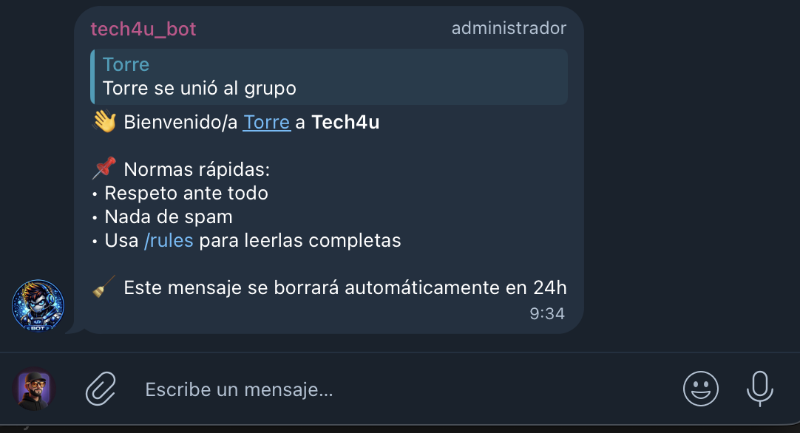
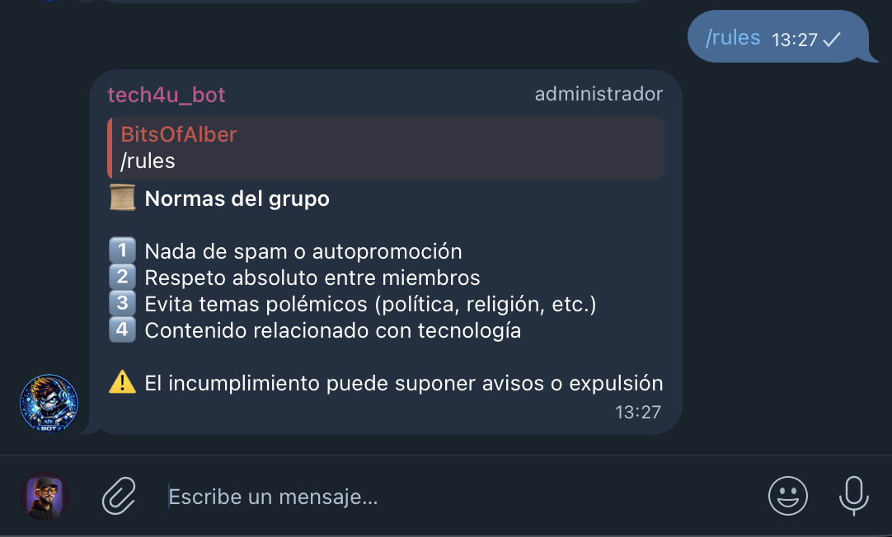

## Telegram Community Bot

Self-hosted Telegram automation bot designed for scalable community management, monitoring and engagement.

This project is part of my Raspberry Homelab Infrastructure, focused on secure, containerized, production-like deployments on constrained hardware (Raspberry Pi).


---

##  Objective

Design and deploy a modular Telegram bot with:

- Automated moderation
- Community analytics
- Infrastructure alerts
- Secure containerized architecture
- SQLite persistence
- Scheduled background tasks

Built with a DevOps + SysAdmin mindset.

---

##  Technical Stack

- Python 3.11
- python-telegram-bot (async)
- Docker
- SQLite
- JobQueue scheduler
- Linux-based deployment (Raspberry Pi)
- VPN-only access model (Tailscale in production)

---

##  Features

###  Community Management

- Automated welcome messages (auto-delete after 24h)
- `/rules` command
- `/whoami` user lookup
- Warning system for moderation
- `/announce` admin announcements (optional pin)
- `/top` active users ranking

---

###  Engagement & Analytics

- SQLite-based message tracking
- Activity statistics
- Top active users (weekly/daily)
- Scheduled milestone announcements (e.g., 900, 1000 members)
- Background jobs for automation

---

###  Infrastructure Integration

- Telegram-based alerting system
- Backup status notifications
- Service monitoring integration
- Container health awareness

---

##  Architecture

Telegram API
↓
Docker Container (Non-root user)
↓
SQLite Database (Persistent volume)
↓
Scheduled Jobs (Async JobQueue)

### Deployment Model

- Containerized
- No root execution
- Capability dropping
- Volume persistence
- Environment variable configuration

---

##  Security Design

- No public port exposure
- Production deployment via VPN-only access
- Non-root Docker user
- Capability dropping (`cap_drop`)
- `no-new-privileges` enabled
- Secrets handled via `.env` (excluded from repository)
- SQLite persistence isolated in dedicated volume

---

##  Deployment

###  Configure environment

Create a `.env` file (never commit this file):

```env
BOT_TOKEN=your_real_token
ADMIN_CHAT_ID=your_chat_id
```

Build & Run
docker compose up -d --build

View Logs
docker logs -f telegram-community-bot

# Bot Interaction Examples

Welcome Messages

<p align="center">
  
</p>

Rules Commands

<p align="center">
  
</p>

Help Commands

<p align="center">
  
</p>

## Learning Outcomes

This project demonstrates:
	•	Containerized Python application deployment
	•	Secure secret management practices
	•	SQLite persistence in Docker
	•	Scheduled background task orchestration
	•	Infrastructure-level thinking for small-scale systems
	•	DevOps-oriented documentation

## Part of

Raspberry Homelab Infrastructure
Self-hosted secure services running on ARM-based hardware.

Author: Alberto Hidalgo Moreno
ASIR Student | Cybersecurity & Infrastructure Enthusiast


